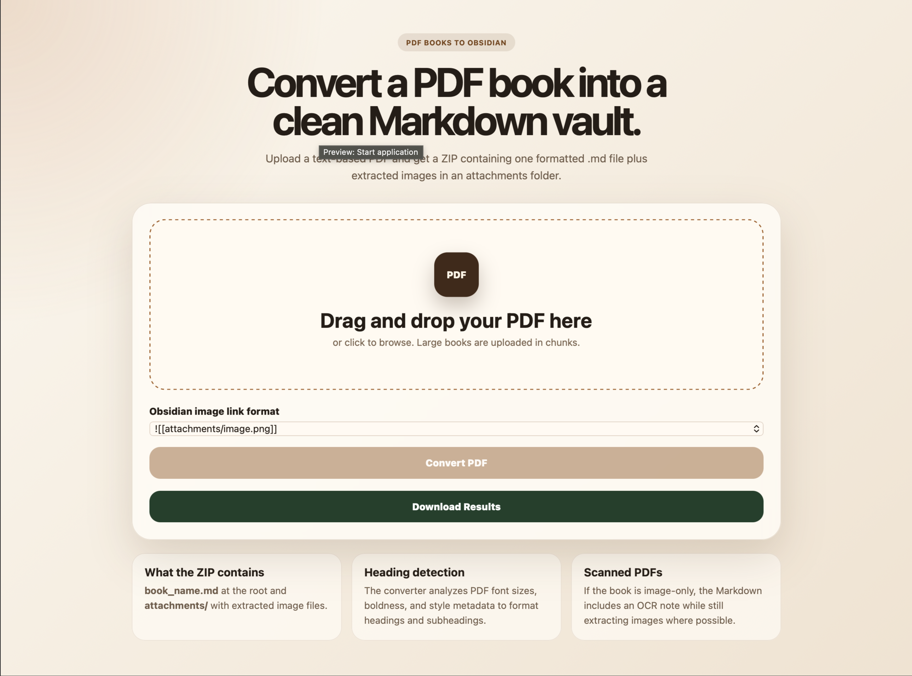
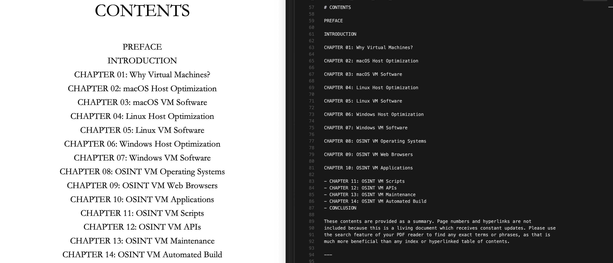

# PDF Book to Obsidian Markdown Converter

A local web application that converts uploaded PDF books into Obsidian-ready Markdown vault exports. It extracts text, headings, bold formatting, page breaks, bullet lists, and images, then packages everything into a downloadable ZIP file.



## What This Project Does

This project helps you turn a PDF book, guide, manual, or long document into a Markdown file that can be opened directly in Obsidian.

It creates a ZIP file with this structure:

```text
book_name.zip
├── book_name.md
└── attachments/
    ├── image_0001.png
    ├── image_0002.png
    └── ...
```

The generated Markdown includes Obsidian image embeds such as:

```md
![[attachments/image_0001.png]]
```

or, if selected in the app:

```md
![[image_0001.png]]
```

## Key Features

- Drag-and-drop PDF upload interface
- Chunked uploads for large PDF books
- Progress updates while uploading, parsing, extracting, and zipping
- Text extraction from text-based PDFs
- Heading and subheading detection from PDF font metadata
- Bold body text preservation using Markdown syntax: `***bold text***`
- PDF line break preservation
- Bullet point detection and conversion into Markdown lists
- Page separators using `---` whenever the PDF changes pages
- Image extraction into an `attachments/` folder
- Obsidian-compatible internal image links
- ZIP download after conversion finishes
- Scanned PDF warning when little or no extractable text is found

## Formatting Example

The converter is designed to preserve PDF reading flow as closely as possible.



Example Markdown output:

```md
# Example Book

This is normal text with ***bold text*** inside the paragraph.

- First bullet item
- Second bullet item
- Third bullet item

---

Text from the next PDF page.

![[attachments/image_0001.png]]
```

## How It Works

The app uses Python and Flask for the web interface and PyMuPDF for PDF processing.

Processing flow:

1. The browser uploads the PDF in small chunks.
2. The server reassembles the chunks into the original PDF.
3. PyMuPDF reads each PDF page.
4. Text spans are inspected for:
   - font size
   - font name
   - bold flags
   - position on the page
   - line spacing
   - indentation
5. Headings are detected from larger or bold font styles.
6. Bold body spans are wrapped as `***bold text***`.
7. Bullet-like lines are converted to Markdown list items.
8. Images are extracted and saved into `attachments/`.
9. Image links are inserted into the Markdown near their PDF position.
10. `---` is inserted between PDF pages.
11. The Markdown file and attachments folder are zipped for download.

## Requirements

- Python 3.11 or newer
- pip
- A modern web browser

Python packages:

- Flask
- PyMuPDF

They are listed in `requirements.txt`.

## Installation

### macOS

1. Install Python 3.11 or newer.

   If you use Homebrew:

   ```bash
   brew install python
   ```

2. Clone the repository:

   ```bash
   git clone https://github.com/YOUR_USERNAME/YOUR_REPOSITORY.git
   cd YOUR_REPOSITORY
   ```

3. Create a virtual environment:

   ```bash
   python3 -m venv .venv
   ```

4. Activate the virtual environment:

   ```bash
   source .venv/bin/activate
   ```

5. Install dependencies:

   ```bash
   pip install -r requirements.txt
   ```

6. Run the app:

   ```bash
   python app.py
   ```

7. Open the app in your browser:

   ```text
   http://localhost:5000
   ```

### Windows

1. Install Python 3.11 or newer from:

   ```text
   https://www.python.org/downloads/
   ```

   During installation, enable:

   ```text
   Add Python to PATH
   ```

2. Clone the repository:

   ```powershell
   git clone https://github.com/YOUR_USERNAME/YOUR_REPOSITORY.git
   cd YOUR_REPOSITORY
   ```

3. Create a virtual environment:

   ```powershell
   py -m venv .venv
   ```

4. Activate the virtual environment:

   ```powershell
   .\.venv\Scripts\Activate.ps1
   ```

   If PowerShell blocks activation, run:

   ```powershell
   Set-ExecutionPolicy -ExecutionPolicy RemoteSigned -Scope CurrentUser
   ```

   Then activate again:

   ```powershell
   .\.venv\Scripts\Activate.ps1
   ```

5. Install dependencies:

   ```powershell
   pip install -r requirements.txt
   ```

6. Run the app:

   ```powershell
   python app.py
   ```

7. Open the app in your browser:

   ```text
   http://localhost:5000
   ```

### Linux

1. Install Python 3.11 or newer.

   Debian/Ubuntu:

   ```bash
   sudo apt update
   sudo apt install python3 python3-pip python3-venv git
   ```

   Fedora:

   ```bash
   sudo dnf install python3 python3-pip git
   ```

   Arch Linux:

   ```bash
   sudo pacman -S python python-pip git
   ```

2. Clone the repository:

   ```bash
   git clone https://github.com/YOUR_USERNAME/YOUR_REPOSITORY.git
   cd YOUR_REPOSITORY
   ```

3. Create a virtual environment:

   ```bash
   python3 -m venv .venv
   ```

4. Activate the virtual environment:

   ```bash
   source .venv/bin/activate
   ```

5. Install dependencies:

   ```bash
   pip install -r requirements.txt
   ```

6. Run the app:

   ```bash
   python app.py
   ```

7. Open the app in your browser:

   ```text
   http://localhost:5000
   ```

## Optional: Run With uv

If you prefer using `uv`, you can run:

```bash
uv sync
uv run python app.py
```

## Usage

1. Start the app.
2. Open `http://localhost:5000` in your browser.
3. Drag and drop a PDF file into the upload area.
4. Choose your Obsidian image link format:
   - `![[attachments/image.png]]`
   - `![[image.png]]`
5. Click `Convert PDF`.
6. Wait for the progress bar to finish.
7. Click `Download Results`.
8. Extract the ZIP file into your Obsidian vault.

## Obsidian Setup Notes

For best results, place the generated Markdown file and the `attachments/` folder together in the same Obsidian folder.

If you use this link style:

```md
![[attachments/image_0001.png]]
```

keep the folder structure like this:

```text
Your Obsidian Vault/
└── Imported Book/
    ├── book_name.md
    └── attachments/
        └── image_0001.png
```

If you use this link style:

```md
![[image_0001.png]]
```

move the images according to your Obsidian attachment settings.

## Output Details

### Markdown

The main `.md` file includes:

- document title
- detected headings
- body paragraphs
- bold text formatting
- Markdown bullet lists
- page separators
- Obsidian image embeds
- scanned PDF warning when needed

### Images

Images are saved in the `attachments/` directory. The app attempts to preserve original image quality and renders low-resolution image regions at 300 DPI when needed.

### Page Separators

Every PDF page transition is written as:

```md
---
```

This makes it easier to see where one original PDF page ended and the next page began.

## Large PDF Handling

The browser uploads files in chunks instead of sending the entire PDF in one request. This helps with large books and reduces the chance of upload failures.

Runtime files are stored temporarily in your system temp directory under:

```text
pdf_obsidian_converter
```

## Scanned PDFs and OCR

This app prioritizes text-based PDFs.

If a PDF is scanned, meaning the pages are mostly images of text, there may be little or no extractable text. In that case, the generated Markdown includes a note saying OCR may be required.

OCR is not currently built into this project.

## Project Structure

```text
.
├── app.py
├── requirements.txt
├── templates/
│   └── index.html
├── static/
│   ├── app.js
│   └── style.css
├── docs/
│   └── images/
│       ├── line-break-example.png
│       └── bullet-detection-example.png
└── README.md
```

## Configuration

By default, the app runs on port `5000`.

You can change the port by setting the `PORT` environment variable.

macOS/Linux:

```bash
PORT=8000 python app.py
```

Windows PowerShell:

```powershell
$env:PORT=8000
python app.py
```

Then open:

```text
http://localhost:8000
```

## Troubleshooting

### `python` command not found

Use `python3` on macOS/Linux or `py` on Windows.

### PyMuPDF installation fails

Upgrade pip first:

```bash
python -m pip install --upgrade pip
pip install -r requirements.txt
```

### The Markdown has little or no text

The PDF is probably scanned or image-based. Run OCR on the PDF first, then upload the OCR version.

### Images appear but text is missing

The PDF likely stores pages as images. OCR is required for text extraction.

### Obsidian images do not show

Make sure the `attachments/` folder is in the same folder as the generated Markdown file, or select the plain image link format and move attachments based on your Obsidian settings.

## Limitations

- OCR is not included.
- Complex multi-column PDFs may need manual cleanup.
- Some PDFs encode bullets, fonts, or reading order in unusual ways.
- Exact visual layout is not recreated; the goal is clean Markdown that works well in Obsidian.

## Development

Run the app locally:

```bash
python app.py
```

The main backend logic is in `app.py`.

Frontend files:

```text
templates/index.html
static/app.js
static/style.css
```

## License

Add your preferred license before publishing. Common choices include MIT, Apache-2.0, and GPL-3.0.

## Contributing

Issues and pull requests are welcome. Good areas for improvement include:

- OCR support
- better multi-column layout detection
- EPUB export
- custom image naming
- batch PDF conversion
- more Obsidian formatting options
